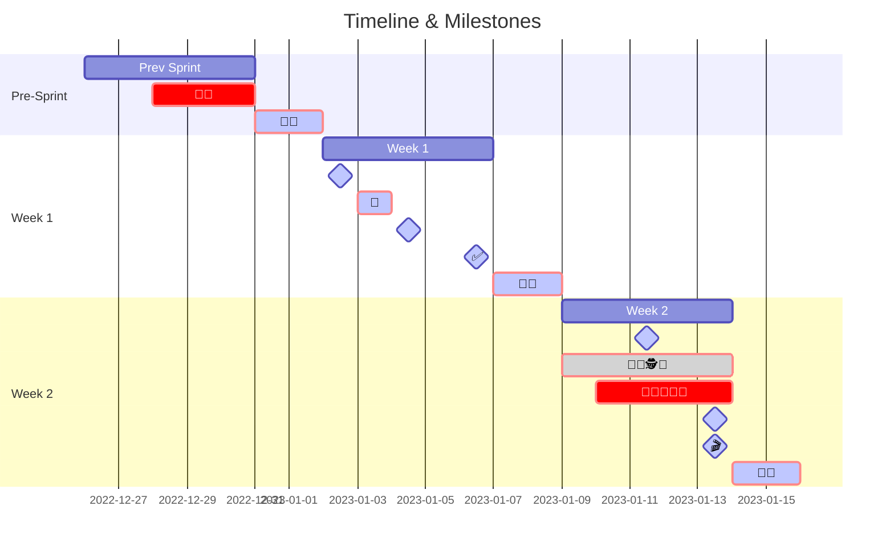
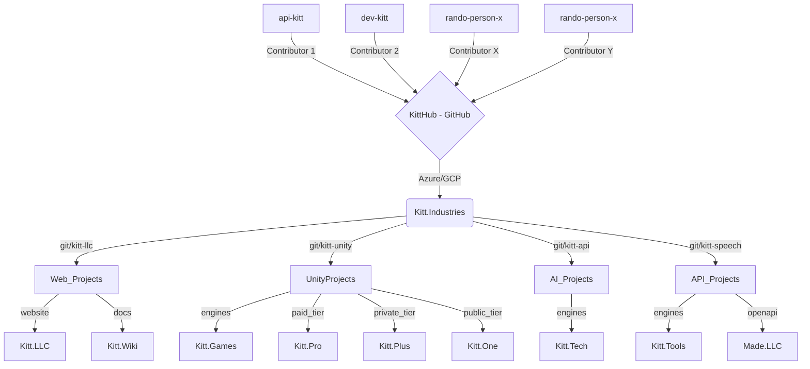

<a name="readme-top"></a>

<!-- PROJECT SHIELDS -->
<!--
*** I'm using markdown "reference style" links for readability.
*** Reference links are enclosed in brackets [ ] instead of parentheses ( ).
*** See the bottom of this document for the declaration of the reference variables
*** for contributors-url, forks-url, etc. This is an optional, concise syntax you may use.
*** https://www.markdownguide.org/basic-syntax/#reference-style-links
-->
[![Contributors][contributors-shield]][contributors-url]
[![Forks][forks-shield]][forks-url]
[![Stargazers][stars-shield]][stars-url]
[![Issues][issues-shield]][issues-url]
[![MIT License][license-shield]][license-url]
[![LinkedIn][linkedin-shield]][linkedin-url]


<!-- PROJECT LOGO -->
<br />
<div align="center">
  <picture>
    <source media="(prefers-color-scheme: dark)" srcset="https://github.com/kitt-llc/.github/blob/main/src/assets/ReadMe-Night.png">
    <source media="(prefers-color-scheme: light)" srcset="https://github.com/kitt-llc/.github/blob/main/src/assets/ReadMe-Day.png">
    
  </picture>

<h3 align="center">Kitt, LLC</h3>

  <p align="center">
    Keep IT Together
    <br />
    <a href="https://github.com/kitt-llc/repo_name"><strong>Explore the docs »</strong></a>
    <br />
    <br />
    <a href="https://github.com/kitt-llc/repo_name">View Demo</a>
    ·
    <a href="https://github.com/kitt-llc/repo_name/issues">Report Bug</a>
    ·
    <a href="https://github.com/kitt-llc/repo_name/issues">Request Feature</a>
  </p>
</div>


<!-- TABLE OF CONTENTS -->
<details>
  <summary>Table of Contents</summary>
  <ol>
    <li><a href="#about-the-project">About the Project</a></li>
    <li><a href="#rabbit-hole">Rabbit Hole</a></li>
    <li><a href="#roadmap">Roadmap</a></li>
    <li><a href="#repo-structure">Repo-Structure</a></li>
    <li><a href="#contributing">Contributing</a></li>
    <li><a href="#license">License</a></li>
    <li><a href="#contact">Contact</a></li>
    <li><a href="#getting-started">Getting Started</a></li>
    <li><a href="#usage">Usage</a></li>
    <li><a href="#tech-stack">Tech Stack</a></li>
  </ol>
</details>


<!-- ABOUT THE PROJECT -->
## <span style="color:#555555" name="about-the-project"><u> **ABOUT THE PROJECT** </u></span>

[![Product Name Screen Shot][product-gif]](https://example.com)

We are a collection of daytime professionals, moonlighting the world of Internet Technology to build cool and useful things with computers. As curious nighttime creatures we most commonly identify as `Kits`, known in the animal kingdom as young or undersized fur-bearing animals such as `squirrels`, `beavers`, `rabbits`, `foxes`, or `rabbits`. We thrive in challenging environments, strive to exceeded expectations, and defy conventions while operating in new, advanced, and emerging technologies.

Our `Kitt's` come in many forms, specializing in software development, test automation, data analytics, APIs, cloud architecture, AR/VR & computer vision, advanced AI, gaming platforms, models, languages and tooling. Simply put - we `Keep IT Together` with thoughful and forward thinking development. Through the course of our long and weathered journeys, we have learned just how unconventionally valuable our paths have been and, when merged, allow us to create uniquely thoughtful products.

[![ForDevs][ForDevs]][ForDevs-url]

<p align="right">(<a href="#readme-top">back to top</a>)</p>


<!-- RABBIT HOLE -->
## <span style="color:#555555" name="rabbit-hole"><u> **ENTER THE RABBIT HOLE** </u></span>

By day, you can find most of us building the front-to-backend systems that power industries and enterprise companies around the country. At night, we emerge from our corporate dens to play, to learn, to create, and to ironically traverse the infinite rabbit holes of technology. As pathfinders, and diggers, we journey through unchareted territories to discovery new worlds of possibilities to unlock our human potential.

We may not have the fancy degrees, the investors, the corporate lawyers, or even an HR department ... but we most certainly have one thing to our advantage - we don't know any better.

Ready to join us on a strange journey to unlock our human potential and discover new worlds of possibilities through open-source projects! [Contact Us](mailto:kitt@made.llc)


<p align="right">(<a href="#readme-top">back to top</a>)</p>


<!-- ROADMAP -->
## <span style="color:#555555" name="roadmap"><u> **ROADMAP** </u></span>

Below is a proposed 2 week sprint cadence and timeline for all agile development efforts conducted by `Kitt Devs` and `Communtiy Contributors`.


<details>
  <summary><span style="color:hotpink"> KEY </span></summary>

- 🧙 = Scrum Master
- 👨‍💻 = DEV
- 👨‍🚀 = QA
- 🕵 = BSA
- 🤖 = Automation
- 📆* = Sprint Ceremony
- ✅ = Sign-off
- 🚫 = Cut-off
- 🎬 = Demo
- 🌮🌮 = Break 4 Tacos

</details>



- 📆* Reoccurring Sprint Ceremonies:
  - **1st Monday = Sprint Planning**
  - **1st Tuesday = Automation Planning**
  - **Every Wednesday = Grooming**
  - **2nd Friday = Sprint Sign-Off**
  - **Last Tuesday of Every Sprint = Code Cut-off**
  - **Last Week of Every Sprint = QA/UAT Sign-Off**
  - **Last Friday = Retro & Demo**


See the [open issues](https://github.com/kitt-llc/repo_name/issues) for a full list of proposed features (and known issues). 

<p align="right">(<a href="#readme-top">back to top</a>)</p>


<!-- REPO-STRUCTURE -->
## <span style="color:#555555" name="repo-structure"><u> **REPO-STRUCTURE** </u></span> 
Unity Integration [reference](https://docs.unity.com/ads/en/manual/UnityDeveloperIntegrations)
 | Cognative Speech Controls [reference](https://azure.microsoft.com/en-us/products/cognitive-services/speech-services/)
 | OpenAI API Integration [reference](https://platform.openai.com/docs/introduction)





<!-- CONTRIBUTING -->
## <span style="color:#555555" name="contributing"><u> **CONTRIBUTING** </u></span>

Contributions are what make the open source community such an amazing place to learn, inspire, and create. Any contributions you make are **greatly appreciated**.

If you have a suggestion that would make this better, please fork the repo and create a pull request. You can also simply open an issue with the tag "enhancement".
Don't forget to give the project a star! Thanks again!

1. Fork the Project
2. Create your Feature Branch (`git checkout -b feature/AmazingFeature`)
3. Commit your Changes (`git commit -m 'Add some AmazingFeature'`)
4. Push to the Branch (`git push origin feature/AmazingFeature`)
5. Open a Pull Request

<p align="right">(<a href="#readme-top">back to top</a>)</p>


<!-- LICENSE -->
## <span style="color:#555555" name="license"><u> **LICENSE** </u></span>

Distributed under the Kitt, LLC License. See [license](Kitt,%20LLC) for more information.

<p align="right">(<a href="#readme-top">back to top</a>)</p>


<!-- CONTACT -->
## <span style="color:#555555" name="contact"><u> **CONTACT** </u></span>

- [Email Us](mailto:kitt@made.llc) 
- Project Link: [https://github.com/kitt-llc/repo_name](https://github.com/kitt-llc/repo_name)
- Social Media: `do we have to?`
  - "If you build it, they will come"
  - Maybe a LinkedIn page `[COMING SOON]`
- [Our Website](https://kitt.llc)

<p align="right">(<a href="#readme-top">back to top</a>)</p>


<!-- GETTING STARTED -->
## <span style="color:#555555" name="getting-started"><u> **GETTING STARTED** </u></span>

Kitt, LLC is currently operating as a stealth startup - meaning the visibility of our products and services is limited within the scope of Pre-Alpha development.

**`[COMING SOON]`**


### Prerequisites

This is an example of how to list things you need to use the software and how to install them.
* npm
  ```sh
  npm install npm@latest -g
  ```

### Installation

1. Get a free API Key at [https://example.com](https://example.com)
2. Clone the repo
   ```sh
   git clone https://github.com/kitt-llc/repo-name.git
   ```
3. Install NPM packages
   ```sh
   npm install
   ```
4. Enter your API in `config.js`
   ```js
   const API_KEY = 'ENTER YOUR API';
   ```

<p align="right">(<a href="#readme-top">back to top</a>)</p>


<!-- USAGE EXAMPLES -->
## <span style="color:#555555" name="usage"><u> **USAGE** </u></span>

Use this space to show useful examples of how the project can be used. Additional screenshots, code examples and demos will work well in this space. You may also link to more resources.

_For more examples, please refer to the [Documentation](https://example.com)_

<p align="right">(<a href="#readme-top">back to top</a>)</p>


<!-- TECH STACK BADGES -->
## <span style="color:#555555" name="tech-stack"><u> **TECH STACK** </u></span>
### **Workspace**
[![Windows][Windows]][Windows-url]
[![Nvidia][Nvidia]][Nvidia-url]
[![Ryzen][Ryzen]][Ryzen-url]

[![Macbook][Macbook]][Macbook-url]

### **IDE**
[![VSCode][VSCode]][VSCode-url]
[![AndroidStudio][AndroidStudio]][AndroidStudio-url]
[![XCode][XCode]][XCode-url]

### **Source Control**
[![GitHub][GitHub]][GitHub-url] 
[![GitLab][GitLab]][GitLab-url] 
[![Git][Git]][Git-url] 

### **Cloud**
[![GitHubActions][GitHubActions]][GitHubActions-url]
[![GoogleCloud][GoogleCloud]][GoogleCloud-url]
[![Azure][Azure]][Azure-url] 
[![AzureDevOps][AzureDevOps]][AzureDevOps-url] 
[![AzureFunctions][AzureFunctions]][AzureFunctions-url] 

### **Gaming**
[![Unity][Unity]][Unity-url] 
[![Itch.io][Itch.io]][Itch-url] 
[![Steam][Steam]][Steam-url] 
[![Flutter][Flutter]][Flutter-url] 

### **Database**
[![MySQL][MySQL]][MySQL-url]
[![MongoDB][MongoDB]][MongoDB-url]
[![SQLite][SQLite]][SQLite-url]
[![PostgreSQL][PostgreSQL]][PostgreSQL-url]
[![SSMS][SSMS]][SSMS-url]

### **Development**
[![JQuery][JQuery.com]][JQuery-url]
[![ReactNative][ReactNative]][ReactNative-url]
[![Python][Python]][Python-url]
[![C#][C#]][C#-url]
[![C++][C++]][CPlusPlus-url]
[![Java][Java]][Java-url]
[![JavaScript][JavaScript]][JavaScript-url]
[![Node.js][Node.js]][Node-url]
[![.NET][.NET]][NET-url]
[![Dart][Dart]][Dart-url]
[![HTML5][HTML5]][HTML5-url]
[![CSS3][CSS3]][CSS3-url]
[![Bootstrap][Bootstrap]][Bootstrap-url]
[![XCode][Xcode]][Xcode-url]

### **Blockchain**
[![Ethereum][Ethereum]][Ethereum-url]
[![OpenZeppelin][OpenZeppelin]][OpenZeppelin-url]
[![Solidity][Solidity]][Solidity-url]

### **Testing**
[![Jest][Jest]][Jest-url]
[![TestLibrary][TestLibrary]][TestLibrary-url]
[![Mocha.js][Mocha.js]][Mocha-url]
[![Chai.js][Chai.js]][Chai-url]

### **Design**
[![AdobeIllustrator][AdobeIllustrator]][Illustrator-url]
[![Blender][Blender]][Blender-url]
[![Canva][Canva]][Canva-url]
[![Figma][Figma]][Figma-url]
[![Framer][Framer]][Framer-url]

<p align="right">(<a href="#readme-top">back to top</a>)</p>


<!-- MARKDOWN LINKS & IMAGES -->
<!-- https://www.markdownguide.org/basic-syntax/#reference-style-links -->
[contributors-shield]: https://img.shields.io/github/contributors/kitt-llc/repo_name.svg?style=for-the-badge
[contributors-url]: https://github.com/kitt-llc/repo_name/graphs/contributors
[forks-shield]: https://img.shields.io/github/forks/kitt-llc/repo_name.svg?style=for-the-badge
[forks-url]: https://github.com/kitt-llc/repo_name/network/members
[stars-shield]: https://img.shields.io/github/stars/kitt-llc/repo_name.svg?style=for-the-badge
[stars-url]: https://github.com/kitt-llc/kitt-plus/stargazers
[issues-shield]: https://img.shields.io/github/issues/kitt-llc/repo_name.svg?style=for-the-badge
[issues-url]: https://github.com/kitt-llc/repo_name/issues
[license-shield]: https://img.shields.io/github/license/kitt-llc/repo_name.svg?style=for-the-badge
[license-url]: https://github.com/kitt-llc/repo_name/blob/master/LICENSE.txt
[linkedin-shield]: https://img.shields.io/badge/-LinkedIn-black.svg?style=for-the-badge&logo=linkedin&colorB=555
[linkedin-url]: https://linkedin.com/
[product-gif]: https://github.com/kitt-llc/.github/blob/main/src/assets/kitt.gif

<!-- WORKSPACE BADGES -->
[Nvidia]: https://img.shields.io/badge/NVIDIA-RTX3060-76B900?style=for-the-badge&logo=nvidia&logoColor=white
[Nvidia-url]: https://www.nvidia.com/en-us/
[Ryzen]: https://img.shields.io/badge/AMD-Ryzen_7_5800H-ED1C24?style=for-the-badge&logo=amd&logoColor=white
[Ryzen-url]: https://www.amd.com/en/processors/ryzen
[Windows]: https://img.shields.io/badge/Windows-Lenovo_Leigon_S7-15ACH6?style=for-the-badge&logo=windows&logoColor=white
[Windows-url]: https://www.lenovo.com/us/en/p/laptops/legion-laptops/legion-7-series/legion-s7-15ach6/88gmy701595/
[Macbook]: https://img.shields.io/badge/Apple-MacBook_Pro_2022-999999?style=for-the-badge&logo=apple&logoColor=white
[Macbook-url]: https://www.apple.com/macbook-pro-14-and-16/

<!-- IDE BADGES -->
[XCode]: https://img.shields.io/badge/Xcode-007ACC?style=for-the-badge&logo=Xcode&logoColor=white
[XCode-url]: https://developer.apple.com/xcode/
[VSCode]: https://img.shields.io/badge/Visual_Studio_Code-0078D4?style=for-the-badge&logo=visual%20studio%20code&logoColor=white
[VSCode-url]: https://www.vscode.com
[AndroidStudio]: https://img.shields.io/badge/Android_Studio-3DDC84?style=for-the-badge&logo=android-studio&logoColor=white
[AndroidStudio-url]: https://www.vscode.com

<!-- SOURCE CONTROL BADGES -->
[GitHub]: https://img.shields.io/badge/GitHub-100000?style=for-the-badge&logo=github&logoColor=white
[GitHub-url]: https://github.com/
[ReactNative]: https://img.shields.io/badge/React_Native-20232A?style=for-the-badge&logo=react&logoColor=61DAFB
[ReactNative-url]: https://reactnative.dev/
[GitLab]: https://img.shields.io/badge/GitLab-330F63?style=for-the-badge&logo=gitlab&logoColor=white
[GitLab-url]: https://about.gitlab.com/
[GitHubActions]: https://img.shields.io/badge/GitHub_Actions-2088FF?style=for-the-badge&logo=github-actions&logoColor=white
[GitHubActions-url]: https://github.com/features/actions
[Git]: https://img.shields.io/badge/GIT-E44C30?style=for-the-badge&logo=git&logoColor=white
[Git-url]: https://git-scm.com/

<!-- GAMING BADGES -->
[Unity]: https://img.shields.io/badge/Unity-100000?style=for-the-badge&logo=unity&logoColor=white
[Unity-url]: https://unity.com/
[Itch.io]: https://img.shields.io/badge/Itch.io-FA5C5C?style=for-the-badge&logo=itchdotio&logoColor=white
[Itch-url]: https://itch.io/
[Steam]: https://img.shields.io/badge/Steam-000000?style=for-the-badge&logo=steam&logoColor=white
[Steam-url]: https://store.steampowered.com/
[Flutter]: https://img.shields.io/badge/Flutter-02569B?style=for-the-badge&logo=flutter&logoColor=white
[Flutter-url]: https://flutter.dev/

<!-- CLOUD BADGES -->
[Azure]: https://img.shields.io/badge/Microsoft_Azure-0089D6?style=for-the-badge&logo=microsoft-azure&logoColor=white
[Azure-url]: https://azure.microsoft.com/
[AzureDevOps]: https://img.shields.io/badge/Azure_DevOps-0078D7?style=for-the-badge&logo=azure-devops&logoColor=white
[AzureDevOps-url]: https://azure.microsoft.com/en-us/products/devops
[AzureFunctions]: https://img.shields.io/badge/Azure_Functions-0062AD?style=for-the-badge&logo=azure-functions&logoColor=white
[AzureFunctions-url]: https://azure.microsoft.com/en-us/products/functions/
[GoogleCloud]: https://img.shields.io/badge/Google_Cloud-4285F4?style=for-the-badge&logo=google-cloud&logoColor=white
[GoogleCloud-url]: https://cloud.google.com/

<!-- DATABASE BADGES -->
[MySQL]: https://img.shields.io/badge/MySQL-005C84?style=for-the-badge&logo=mysql&logoColor=white
[MySQL-url]: https://www.mysql.com/
[MongoDB]: https://img.shields.io/badge/MongoDB-4EA94B?style=for-the-badge&logo=mongodb&logoColor=white
[MongoDB-url]: https://www.mongodb.com/
[PostgreSQL]: https://img.shields.io/badge/PostgreSQL-316192?style=for-the-badge&logo=postgresql&logoColor=white
[PostgreSQL-url]: https://www.postgresql.org/
[SQLite]: https://img.shields.io/badge/SQLite-07405E?style=for-the-badge&logo=sqlite&logoColor=white
[SQLite-url]: https://sqlite.org/index.html
[SSMS]: https://img.shields.io/badge/Microsoft%20SQL%20Server-CC2927?style=for-the-badge&logo=microsoft%20sql%20server&logoColor=white
[SSMS-url]: https://learn.microsoft.com/en-us/sql/ssms/


<!-- DEVELOPMENT BADGES -->
[ForDevs]: https://forthebadge.com/images/badges/built-by-developers.svg
[ForDevs-url]: https://dev.to/
[C++]: https://img.shields.io/badge/C%2B%2B-00599C?style=for-the-badge&logo=c%2B%2B&logoColor=white
[CPlusPlus-url]: https://cplusplus.com/
[C#]: https://img.shields.io/badge/C%23-239120?style=for-the-badge&logo=c-sharp&logoColor=white
[C#-url]: https://learn.microsoft.com/en-us/dotnet/csharp/
[Dart]: https://img.shields.io/badge/Dart-0175C2?style=for-the-badge&logo=dart&logoColor=white
[Dart-url]: https://dart.dev/ 
[Java]: https://img.shields.io/badge/Java-ED8B00?style=for-the-badge&logo=openjdk&logoColor=white
[Java-url]: https://www.java.com
[JavaScript]: https://img.shields.io/badge/JavaScript-323330?style=for-the-badge&logo=javascript&logoColor=F7DF1E
[JavaScript-url]: https://www.javascript.com/ 
[JQuery.com]: https://img.shields.io/badge/jQuery-0769AD?style=for-the-badge&logo=jquery&logoColor=white
[JQuery-url]: https://jquery.com 
[.NET]: https://img.shields.io/badge/.NET-5C2D91?style=for-the-badge&logo=.net&logoColor=white
[NET-url]: https://dotnet.microsoft.com/en-us/learn/dotnet/what-is-dotnet 
[Node.js]: https://img.shields.io/badge/Node.js-43853D?style=for-the-badge&logo=node.js&logoColor=white
[Node-url]: https://nodejs.org/en 
[Python]: https://img.shields.io/badge/Python-14354C?style=for-the-badge&logo=python&logoColor=white
[Python-url]: https://www.python.org/ 


<!-- FRONT-END BADGES -->
[Bootstrap]: https://img.shields.io/badge/Bootstrap-563D7C?style=for-the-badge&logo=bootstrap&logoColor=white
[Bootstrap-url]: https://getbootstrap.com
[CSS3]: https://img.shields.io/badge/CSS3-1572B6?style=for-the-badge&logo=css3&logoColor=white
[CSS3-url]: https://www.w3schools.com/css/
[HTML5]: https://img.shields.io/badge/HTML5-E34F26?style=for-the-badge&logo=html5&logoColor=white
[HTML5-url]: https://www.w3schools.com/html/ 

<!-- BLOCKCHAIN W/BADGES -->
[Ethereum]: https://img.shields.io/badge/Ethereum-3C3C3D?style=for-the-badge&logo=Ethereum&logoColor=white
[Ethereum-url]: https://ethereum.org/en/
[OpenZeppelin]: https://img.shields.io/badge/OpenZeppelin-4E5EE4.svg?style=for-the-badge&logo=OpenZeppelin&logoColor=white
[OpenZeppelin-url]: https://www.openzeppelin.com/
[Solidity]: https://img.shields.io/badge/Solidity-363636.svg?style=for-the-badge&logo=Solidity&logoColor=white
[Solidity-url]: https://soliditylang.org/

<!-- TESTING BADGES -->
[Jest]: https://img.shields.io/badge/Jest-323330?style=for-the-badge&logo=Jest&logoColor=white
[Jest-url]: https://jestjs.io/ 
[TestLibrary]: https://img.shields.io/badge/testing%20library-323330?style=for-the-badge&logo=testing-library&logoColor=red
[TestLibrary-url]: https://testing-library.com/ 
[Mocha.js]: https://img.shields.io/badge/mocha.js-323330?style=for-the-badge&logo=mocha&logoColor=Brown
[Mocha-url]: https://mochajs.org/ 
[Chai.js]: https://img.shields.io/badge/chai.js-323330?style=for-the-badge&logo=chai&logoColor=red
[Chai-url]: https://www.chaijs.com/ 

<!-- DESIGNED W/BADGES -->
[AdobeIllustrator]: https://img.shields.io/badge/Adobe%20Illustrator-FF9A00?style=for-the-badge&logo=adobe%20illustrator&logoColor=white
[Illustrator-url]: https://www.adobe.com/creativecloud/products/illustrator.html 
[Blender]: https://img.shields.io/badge/blender-%23F5792A.svg?style=for-the-badge&logo=blender&logoColor=white
[blender-url]: https://www.blender.org/
[Canva]: https://img.shields.io/badge/Canva-%2300C4CC.svg?&style=for-the-badge&logo=Canva&logoColor=white
[Canva-url]: https://canva.com
[Figma]: https://img.shields.io/badge/Figma-F24E1E?style=for-the-badge&logo=figma&logoColor=white
[Figma-url]: https://www.figma.com
[Framer]: https://img.shields.io/badge/Framer-black?style=for-the-badge&logo=framer&logoColor=blue
[Framer-url]: https://www.framer.com/