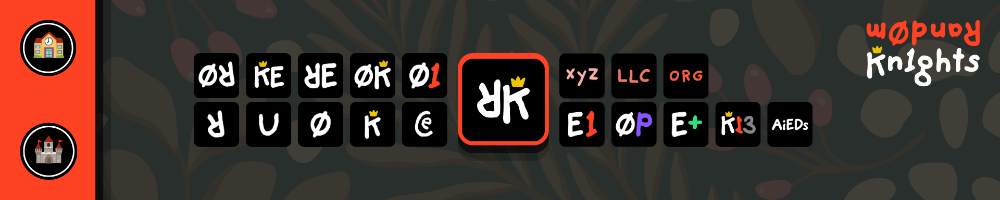
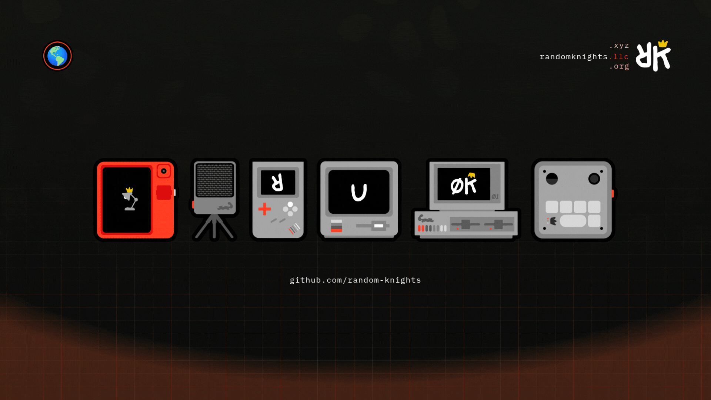
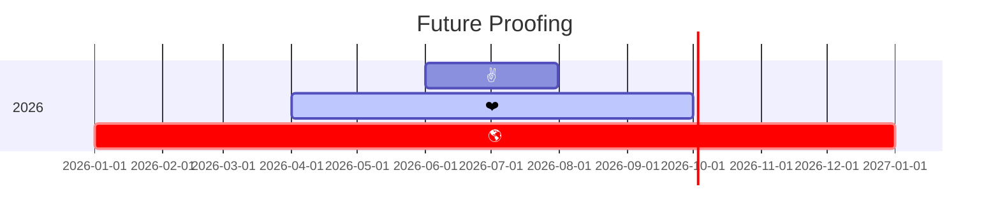

<!-- PROJECT LOGO -->
 

  <picture>
    <source media="(prefers-color-scheme: dark)" srcset="../assets/rk-dark.png">
    <source media="(prefers-color-scheme: light)" srcset="../assets/rk-lite.png">
    
  </picture>

<!-- HERO -->

<h3 align="center" style="color:#ff4124">Random Knights, LLC</h3>

  

    🏫 <a href="https://rand0m.ai">rand0m.ai</a> 2025-2030 🛸 roswell, ga 🍑 <a href="https://randomknights.xyz">ᴚk.xyz</a> + <a href="https://randomknights.llc">ᴚk.llc</a> + <a href="https://randomknights.org">ᴚk.org</a> 🏰
     
    🌝 <a href="https://randomly.engineering">randomly.engineering</a> & <a href="https://knightly.engineering">knightly.engineering</a> 🌚
     
     
    <a href="https://< some demo link >">View Demo</a>
    ·
    <a href="https://github.com/random-knights/< repo >/wiki">View Docs</a>
    ·
    <a href="https://github.com/random-knights/< repo >/issues">Report Bug</a>
     
  

<!-- HERO GIF -->

  

<!-- TITLE -->

<h1 align="center">  🏫  ɯ0puɐɹ   kn1ghts  🏰
</h1>

This family passion project explores agentic systems, environmental 🌎 awareness, digital ownership, personal productivity, creativity, and responsible AI. Some experiments will succeed. Some will fail. All of them will be **ɯ0puɐɹ & random** events can lead to extraordinary outcomes!

The objective of our work is to demonstrate the direct impact of technology, both in its ability to help create and destroy. The world is filled with enough physical and digital "Hot Garbage", how you want to contribute is up to you, but **ONLY YOU** can prevent garbage fires!

- Built with:
  - Maximum Family Effort
  - Rand0m AI Standard : E+ w/ AiEDs & K13
  - [Randomly.Engineering](https://randomly.engineering)
  - [Knightly.Engineering](https://knightly.engineering)
  - Node.js, Flutter and Dart
  - Apache Hive
    - (Firebase Data Connect **coming soon**)
  - Gemini, OpenAI, Claude, Perplexity
  - S.T.E.A.M. and FFmpeg
  - Canva & Adobe Illustrator
  - Cypress / Playwright + Testing-Library
  - Firebase/FlutterFire

[![ForScience][ForScience]][ForScience-url] [![ForDevs][ForDevs]][ForDevs-url] [![ForQAs][ForQAs]][ForQAs-url]

<!-- ABOUT -->

## <u> **ABOUT** </u>

1. **Environmental Awareness** The platform incorporates carbon, tree-time, wildfire, weather, glacier, and Earth-awareness initiatives to help connect technology usage with real-world environmental impact.
   1. <small>**inspired by [earth.nullschool.net](https://earth.nullschool.net/)**</small>
2. **GitHub Source Control:** GitHub provides version control, collaboration workflows, issue tracking, branch protection, code review, and release management across the ecosystem.

3. **CI/CD:** GitHub Actions automates validation, testing, deployment, and release workflows, ensuring every change is verified before reaching production.

4. **Test Automation** Cypress, Playwright, Flutter's native testing framework, and supporting QA tooling help validate functionality, performance, and user experience across web, mobile, and desktop platforms.

5. **Flutter & Dart** Flutter and Dart provide a single codebase capable of powering mobile, web, desktop, and future platform experiences while maintaining a consistent user experience.

6. **Behavior Driven Development** Cucumber BDD promotes collaboration between technical and non-technical stakeholders through human-readable specifications that align implementation with expected behavior.

7. **AI & Agent Systems** `rand0m` leverages multiple `ai` providers and agentic workflows to deliver personalized experiences while maintaining transparency, user control, and provider independence wherever possible.

8. **Data & Storage** Local-first storage, selective cloud integration, and user-controlled data ownership are foundational principles throughout the ecosystem.

Dive in for knightly research, random side-projects, or just for plain old fun.

(<a href="#readme-top">back to top</a>)

<!-- ROADMAP -->

## <u> **ROADMAP** </u>

```mermaid
gantt
title Future Proofing
dateFormat YYYY-MM
section 2026
✌️ :a1, 2026-06, 60d
❤️ :active, a1, 2026-04, 183d
🌎 :crit, a1, 2026-01, 365d
```

<!-- CONTRIBUTING -->

## <u> **CONTRIBUTING** </u>

If you have a suggestion that would make this better, fork the repo and open a pull request &mdash; or open an issue with the tag "enhancement". Don't forget to star the project!

1. Fork the Projects
2. Create your Feature Branch (`git checkout -b feature/AmazingFeature`)
3. Commit your Changes (`git commit -m 'Add some AmazingFeature'`)
4. Push to the Branch (`git push origin feature/AmazingFeature`)
5. Open a Pull Request

follow our progress on [GitHub @ Random Knights](https://github.com/random-knights)

<!-- STANDARD -->

## <u> **STANDARD** </u>

| Name        | :chipmunk: |    Version    |             Description             |
| ----------- | :--------: | :-----------: | :---------------------------------: |
| Earth+      |     🌎     | v1.0.0-draft  |        Earth Health Scoring         |
| AiEDs       |     ⚡     |    v2.1.0     |        AI Energy Disclosure         |
| K13         |     👑     |    v2.0.0     |        AI Summary Reporting         |
| AI for Good |     ❤️     |   &middot;    | (ITU) &middot; (UN) Recommendations |

<!-- OPERATING -->

## <u> **OPERATING** </u>

- [RUNBOOK.md](RUNBOOK.md) - humans: how it deploys (merging to main publishes
  the live site), roll back, what breaks and how to fix it.
- [AGENTS.md](AGENTS.md) - agents: the rules that apply in this repo.

<!-- CONTACT -->

## <u> **CONTACT** </u>

If any issues arise, please draft a strongly worded email and <u>**never**</u> send it to: **admin@rand0m.ai**

(<a href="#readme-top">back to top</a>)

<!----------- BADGES ----------->

<!-- TECHNOLOGY -->

## <u> **TECHNOLOGY** </u>

<!-- ### **Workspace**

[![Windows][Windows]][Windows-url]
[![Nvidia][Nvidia]][Nvidia-url]
[![Ryzen][Ryzen]][Ryzen-url] -->

### **CLI**

[![GitBash][GitBash]][GitBash-url]
[![Herdr][Herdr]][Herdr-url]
[![Powershell][Powershell]][Powershell-url]

### **IDE**

[![VSCode][VSCode]][VSCode-url]

### **Source Control**

[![GitHub][GitHub]][GitHub-url]
[![Git][Git]][Git-url]

### **Database**

[![HiveDB][HiveDB]][HiveDB-url]
[![MongoDB][MongoDB]][MongoDB-url]
[![PostgreSQL][PostgreSQL]][PostgreSQL-url]

### **Tools**

[![CodexMicropad][CodexMicropad]][CodexMicropad-url]
[![TeenageEngineeringMic][TeenageEngineeringMic]][TeenageEngineeringMic-url]
[![NothingHeadphones][NothingHeadphones]][NothingHeadphones-url]
[![RaspberryPi][RaspberryPi]][RaspberryPi-url]

### **Development**

[![Node.js][Node.js]][Node-url]
[![Python][Python]][Python-url]
[![JavaScript][JavaScript]][JavaScript-url]
[![TypeScript][TypeScript]][TypeScript-url]
[![Flutter][Flutter]][Flutter-url]
[![Dart][Dart]][Dart-url]

### **Testing**

[![Chai.js][Chai.js]][Chai-url]
[![Cucumber][Cucumber]][Cucumber-url]
[![Cypress.js][Cypress.js]][Cypress-url]
[![Jest][Jest]][Jest-url]
[![Lighthouse][Lighthouse]][Lighthouse-url]
[![Mocha.js][Mocha.js]][Mocha-url]
[![Swagger.js][Swagger.js]][Swagger-url]
[![TestLibrary][TestLibrary]][TestLibrary-url]

### **AI**

[![OpenAI][OpenAI]][OpenAI-url]
[![Gemini][Gemini]][Gemini-url]
[![Claude][Claude]][Claude-url]
[![RabbitTech][RabbitTech]][RabbitTech-url]
[![Perplexity][Perplexity]][Perplexity-url]
[![Rand0mAI][Rand0mAI]][Rand0mAI-url]
[![HuggingFace][HuggingFace]][HuggingFace-url]
[![Ollama][Ollama]][Ollama-url]

### **Design**

[![AdobeIllustrator][AdobeIllustrator]][Illustrator-url]
[![Canva][Canva]][Canva-url]
[![Figma][Figma]][Figma-url]

### **Pipelines**

[![GoogleCloud][GoogleCloud]][GoogleCloud-url]
[![GitHubActions][GitHubActions]][GitHubActions-url]
[![Firebase][Firebase]][Firebase-url]
[![Jira][Jira]][Jira-url]
[![Slack][Slack]][Slack-url]

### **Research & Funding**

[![ORCiD][ORCiD]][ORCiD-url]
[![OpenCollective][OpenCollective]][OpenCollective-url]

(<a href="#readme-top">back to top</a>)

  🏰🛏️🌚ɯ0puɐɹ  kn1ghts🌝🛋️🏫

<!-- MARKDOWN LINKS & IMAGES -->
<!-- https://www.markdownguide.org/basic-syntax/#reference-style-links -->
<!-- DAY PALETTE GRADIENT PATCH -->
<!-- #ff4124 #faafa5 #fadfdb #b1fec8 -->
<!-- NIGHT PALETTE GRADIENT PATCH -->
<!-- #723848 #ad7a88 #e5bec8 #6fcf8c -->

[contributors-shield]: https://img.shields.io/github/contributors/repo_name.svg?style=for-the-badge
[contributors-url]: https://github.com/random-knights/random-graphs/contributors
[forks-shield]: https://img.shields.io/github/forks/repo_name.svg?style=for-the-badge
[forks-url]: https://github.com/random-knights/random-network/members
[stars-shield]: https://img.shields.io/github/stars/repo_name.svg?style=for-the-badge
[stars-url]: https://github.com/random-knights/stargazers
[issues-shield]: https://img.shields.io/github/issues/repo_name.svg?style=for-the-badge
[issues-url]: https://github.com/random-knights/random-issues
[license-shield]: https://img.shields.io/github/license/repo_name.svg?style=for-the-badge
[license-url]: https://github.com/random-knights/random/blob/master/LICENSE.txt
[linkedin-shield]: https://img.shields.io/badge/LinkedIn-0A66C2?style=for-the-badge&logo=linkedin&logoColor=white
[linkedin-url]: https://linkedin.com/company/random-knights

<!-- WORKSPACE (C1: ff4124) -->

[Nvidia]: https://img.shields.io/badge/NVIDIA-RTX3060-ff4124?style=for-the-badge&logo=nvidia&logoColor=white
[Nvidia-url]: https://www.nvidia.com/en-us/
[Ryzen]: https://img.shields.io/badge/AMD-Ryzen_7_5800H-ff4124?style=for-the-badge&logo=amd&logoColor=white
[Ryzen-url]: https://www.amd.com/en/processors/ryzen
[Windows]: https://img.shields.io/badge/Windows-Lenovo_Legion-ff4124?style=for-the-badge&logo=windows&logoColor=white
[Windows-url]: https://www.lenovo.com/us/en/
[Macbook]: https://img.shields.io/badge/Apple-MacBook_Pro_2022-000000?style=for-the-badge&logo=apple&logoColor=white
[Macbook-url]: https://www.apple.com/macbook-pro/

<!-- CLI (C1: 8855ff) -->

[GitBash]: https://img.shields.io/badge/GitBash-8855ff?style=for-the-badge&logo=git&logoColor=white
[GitBash-url]: https://git-scm.com/
[Herdr]: https://img.shields.io/badge/Herdr-8855ff?style=for-the-badge&logo=herdr&logoColor=white
[Herdr-url]: https://herdr.dev/
[Powershell]: https://img.shields.io/badge/Powershell-8855ff?style=for-the-badge&logo=power-shell&logoColor=white
[Powershell-url]: https://apps.microsoft.com/detail/9mz1snwt0n5d?hl=en-US&gl=US

<!-- IDE (C1: ff4124) -->

[VSCode]: https://img.shields.io/badge/Visual_Studio_Code-ff4124?style=for-the-badge&logo=visualstudiocode&logoColor=white
[VSCode-url]: https://code.visualstudio.com/

<!-- SOURCE CONTROL (C2: faafa5) -->

[GitHub]: https://img.shields.io/badge/GitHub-faafa5?style=for-the-badge&logo=github&logoColor=white
[GitHub-url]: https://github.com/
[Git]: https://img.shields.io/badge/Git-faafa5?style=for-the-badge&logo=git&logoColor=white
[Git-url]: https://git-scm.com/

<!-- DATABASE (C2: faafa5) -->

[MongoDB]: https://img.shields.io/badge/MongoDB-faafa5?style=for-the-badge&logo=mongodb&logoColor=white
[MongoDB-url]: https://www.mongodb.com/
[PostgreSQL]: https://img.shields.io/badge/PostgreSQL-faafa5?style=for-the-badge&logo=postgresql&logoColor=white
[PostgreSQL-url]: https://www.postgresql.org/
[HiveDB]: https://img.shields.io/badge/Hive-faafa5?style=for-the-badge&logo=apachehive&logoColor=white
[HiveDB-url]: https://pub.dev/packages/hive

<!-- TOOLS (C2: ad7a88) -->

[CodexMicropad]: https://img.shields.io/badge/Open_AI-Codex--Micro-ad7a88?style=for-the-badge&logoColor=white
[CodexMicropad-url]: https://openai.com/supply/co-lab/work-louder/
[TeenageEngineeringMic]: https://img.shields.io/badge/Teenage_Engineering-CM--15_Mic-ad7a88?style=for-the-badge&logoColor=white
[TeenageEngineeringMic-url]: https://teenage.engineering/products/cm-15
[NothingHeadphones]: https://img.shields.io/badge/Nothing-Headphone_(1)-ad7a88?style=for-the-badge&logoColor=white
[NothingHeadphones-url]: https://nothing.tech/products/headphone-1
[RaspberryPi]: https://img.shields.io/badge/Raspberry_Pi-ad7a88?style=for-the-badge&logo=raspberrypi&logoColor=white
[RaspberryPi-url]: https://www.raspberrypi.com/

<!-- DEVELOPMENT BADGES -->

[ForDevs]: https://forthebadge.com/images/badges/built-by-developers.svg
[ForDevs-url]: https://forthebadge.com
[ForQAs]: https://forthebadge.com/api/badges/generate?panels=2&primaryLabel=TESTED+BY&secondaryLabel=ENGINEERS&primaryBGColor=%23ff4124&secondaryBGColor=%23faafa5&primaryTextColor=%23FFFFFF&primaryFontSize=12&primaryFontWeight=600&primaryLetterSpacing=2&primaryFontFamily=Roboto&primaryTextTransform=uppercase&secondaryTextColor=%23FFFFFF&secondaryFontSize=12&secondaryFontWeight=900&secondaryLetterSpacing=2&secondaryFontFamily=Montserrat&secondaryTextTransform=uppercase&secondaryIcon=testinglibrary&secondaryIconColor=%23FFFFFF&secondaryIconSize=16&secondaryIconPosition=right
[ForQAs-url]: https://forthebadge.com
[ForScience]: https://forthebadge.com/images/badges/built-with-science.svg
[ForScience-url]: https://forthebadge.com
[JavaScript]: https://img.shields.io/badge/JavaScript-e5bec8?style=for-the-badge&logo=javascript&logoColor=white
[JavaScript-url]: https://www.javascript.com/
[Node.js]: https://img.shields.io/badge/Node.js-e5bec8?style=for-the-badge&logo=node.js&logoColor=white
[Node-url]: https://nodejs.org/
[Python]: https://img.shields.io/badge/Python-e5bec8?style=for-the-badge&logo=python&logoColor=white
[Python-url]: https://www.python.org/
[TypeScript]: https://img.shields.io/badge/TypeScript-e5bec8?style=for-the-badge&logo=typescript&logoColor=white
[TypeScript-url]: https://www.typescriptlang.org/
[Flutter]: https://img.shields.io/badge/Flutter-e5bec8?style=for-the-badge&logo=flutter&logoColor=white
[Flutter-url]: https://flutter.dev/
[Dart]: https://img.shields.io/badge/Dart-e5bec8?style=for-the-badge&logo=dart&logoColor=white
[Dart-url]: https://dart.dev/

<!-- TESTING (C3: fadfdb) -->

[Chai.js]: https://img.shields.io/badge/Chai-fadfdb?style=for-the-badge&logo=chai&logoColor=white
[Chai-url]: https://www.chaijs.com/
[Cucumber]: https://img.shields.io/badge/Cucumber-fadfdb?style=for-the-badge&logo=cucumber&logoColor=white
[Cucumber-url]: https://cucumber.io/
[Cypress.js]: https://img.shields.io/badge/Cypress-fadfdb?style=for-the-badge&logo=cypress&logoColor=white
[Cypress-url]: https://www.cypress.io/
[Jest]: https://img.shields.io/badge/Jest-fadfdb?style=for-the-badge&logo=jest&logoColor=white
[Jest-url]: https://jestjs.io/
[Lighthouse]: https://img.shields.io/badge/Lighthouse-fadfdb?style=for-the-badge&logo=lighthouse&logoColor=white
[Lighthouse-url]: https://developer.chrome.com/docs/lighthouse/
[Mocha.js]: https://img.shields.io/badge/Mocha-fadfdb?style=for-the-badge&logo=mocha&logoColor=white
[Mocha-url]: https://mochajs.org/
[Swagger.js]: https://img.shields.io/badge/Swagger-fadfdb?style=for-the-badge&logo=swagger&logoColor=white
[Swagger-url]: https://swagger.io/
[TestLibrary]: https://img.shields.io/badge/Testing_Library-fadfdb?style=for-the-badge&logo=testing-library&logoColor=white
[TestLibrary-url]: https://testing-library.com/

<!-- DESIGN (C4: b1fec8) -->

[AdobeIllustrator]: https://img.shields.io/badge/Adobe_Illustrator-b1fec8?style=for-the-badge&logo=adobeillustrator&logoColor=black
[Illustrator-url]: https://www.adobe.com/products/illustrator.html
[Canva]: https://img.shields.io/badge/Canva-b1fec8?style=for-the-badge&logo=canva&logoColor=white
[Canva-url]: https://www.canva.com/
[Figma]: https://img.shields.io/badge/Figma-b1fec8?style=for-the-badge&logo=figma&logoColor=white
[Figma-url]: https://www.figma.com/
[Framer]: https://img.shields.io/badge/Framer-b1fec8?style=for-the-badge&logo=framer&logoColor=blue
[Framer-url]: https://www.framer.com/

<!-- PIPELINE (C4: 6fcf8c) -->

[Slack]: https://img.shields.io/badge/Slack-6fcf8c?style=for-the-badge&logo=slack&logoColor=orange
[Slack-url]: https://www.slack.com/
[CypressCloud]: https://img.shields.io/badge/Cypress_Cloud-6fcf8c?style=for-the-badge&logo=cypress&logoColor=orange
[CypressCloud-url]: https://www.cypress.io/
[Firebase]: https://img.shields.io/badge/Firebase-6fcf8c?style=for-the-badge&logo=firebase&logoColor=orange
[Firebase-url]: https://firebase.google.com/
[GitHubActions]: https://img.shields.io/badge/GitHub_Actions-6fcf8c?style=for-the-badge&logo=github-actions&logoColor=orange
[GitHubActions-url]: https://github.com/features/actions
[GoogleCloud]: https://img.shields.io/badge/Google_Cloud-6fcf8c?style=for-the-badge&logo=google-cloud&logoColor=orange
[GoogleCloud-url]: https://cloud.google.com
[Jira]: https://img.shields.io/badge/Jira-6fcf8c?style=for-the-badge&logo=jira&logoColor=orange
[Jira-url]: https://www.atlassian.com/software/jira

<!-- AI (C4: b1fec8) -->

[OpenAI]: https://img.shields.io/badge/OpenAI-b1fec8?style=for-the-badge&logo=openaigym&logoColor=white
[OpenAI-url]: https://openai.com/
[Gemini]: https://img.shields.io/badge/Gemini-b1fec8?style=for-the-badge&logo=google&logoColor=white
[Gemini-url]: https://gemini.google.com/
[Claude]: https://img.shields.io/badge/Claude-b1fec8?style=for-the-badge&logo=anthropic&logoColor=white
[Claude-url]: https://www.anthropic.com/
[RabbitTech]: https://img.shields.io/badge/Rabbit.Tech-FF4124?style=for-the-badge
[RabbitTech-url]: https://www.rabbit.tech/
[Perplexity]: https://img.shields.io/badge/Perplexity-b1fec8?style=for-the-badge&logo=perplexity&logoColor=white
[Perplexity-url]: https://www.perplexity.ai/
[Rand0mAI]: https://img.shields.io/badge/Rand0m.AI-FF4124?style=for-the-badge
[Rand0mAI-url]: https://rand0m.ai/
[HuggingFace]: https://img.shields.io/badge/HuggingFace-b1fec8?style=for-the-badge&logo=huggingface&logoColor=white
[HuggingFace-url]: https://www.huggingface.co/
[Ollama]: https://img.shields.io/badge/Ollama-b1fec8?style=for-the-badge&logo=ollama&logoColor=white
[Ollama-url]: https://www.ollama.com/

<!-- AI (C4: b1fec8) -->

[OpenCollective]: https://img.shields.io/badge/OpenCollective-edc303?style=for-the-badge&logo=opencollective&logoColor=white
[OpenCollective-url]: https://opencollective.com/random-knights
[ORCiD]: https://img.shields.io/badge/ORCiD-edc303?style=for-the-badge&logo=orcid&logoColor=white
[ORCiD-url]: https://orcid.org/0009-0006-5066-1693
